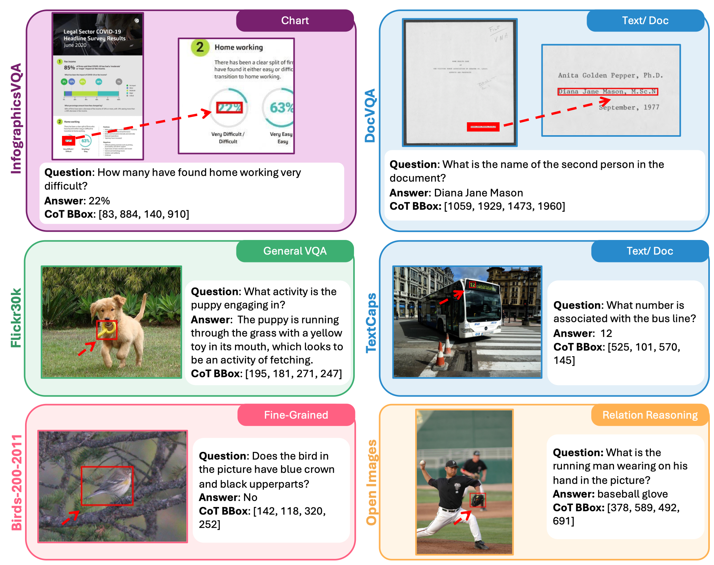
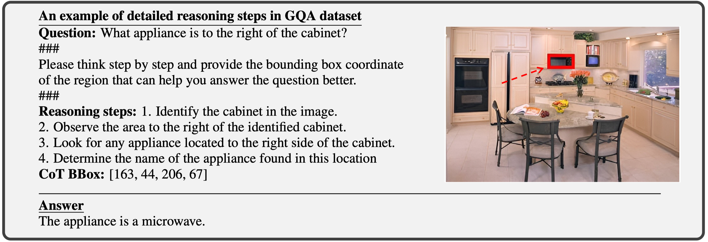
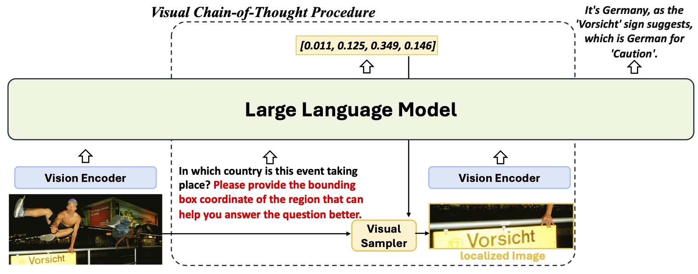
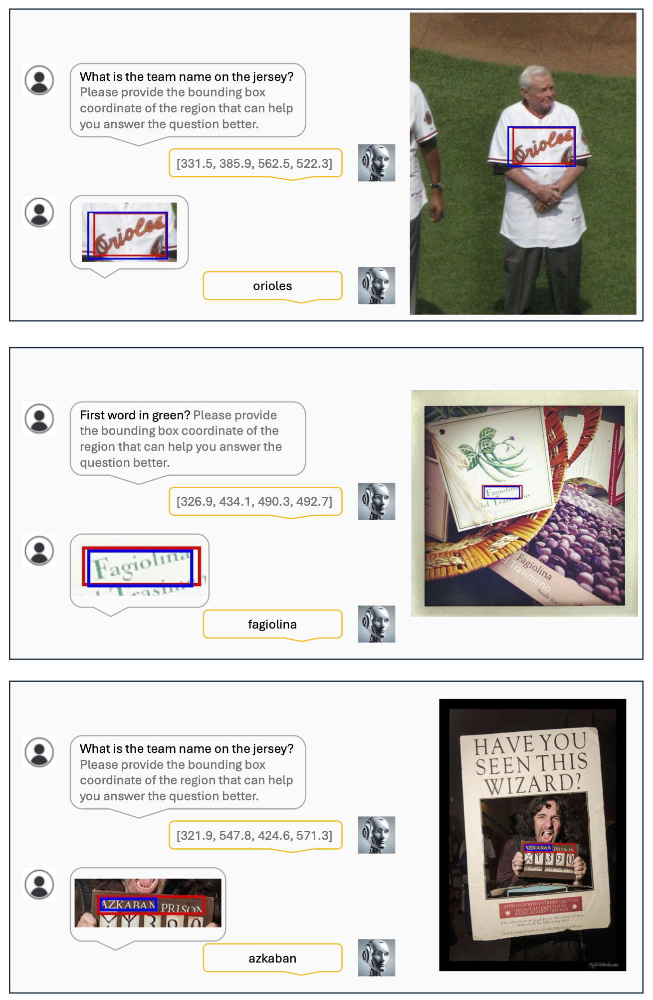
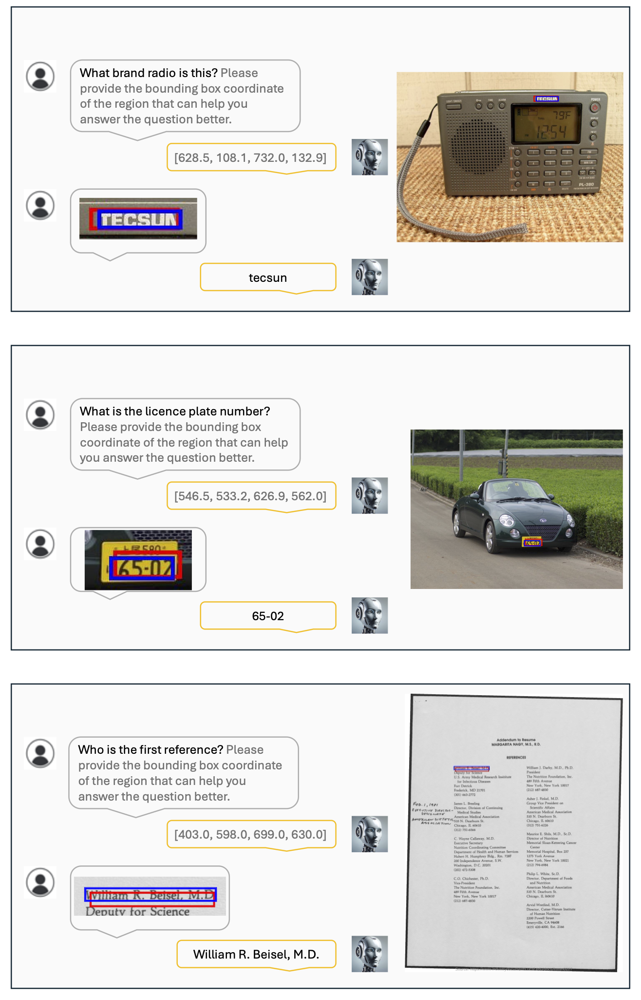
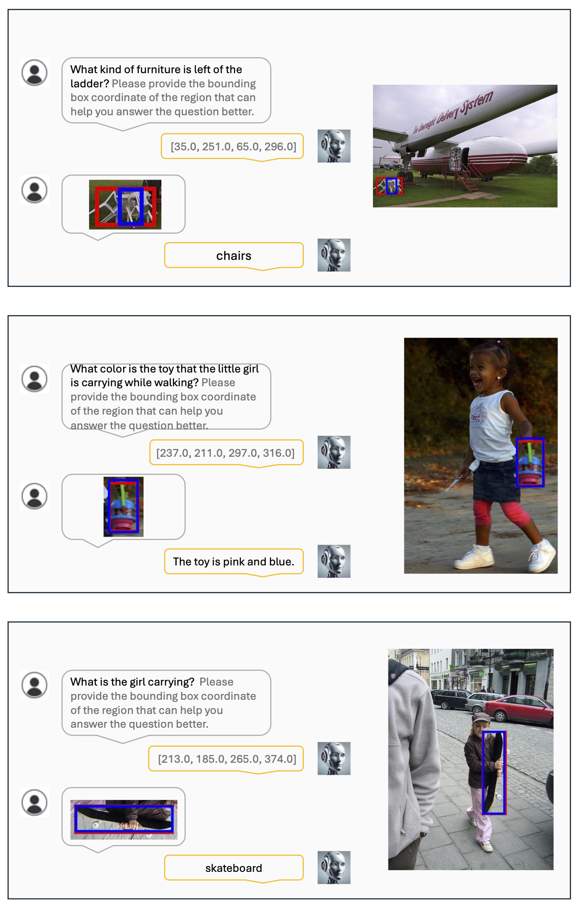

# Visual CoT: Advancing Multi-Modal Language Models with a Comprehensive Dataset and Benchmark for Chain-of-Thought Reasoning





> Hao Shao, Shengju Qian, Han Xiao, Guanglu Song, Zhuofan Zong, Letian Wang, Yu Liu, Hongsheng Li

This repository contains code for the paper [Visual CoT: Advancing Multi-Modal Language Models with a Comprehensive Dataset and Benchmark for Chain-of-Thought Reasoning](https://arxiv.org/abs/2403.16999) and it was built based on [LLaVA](https://github.com/haotian-liu/LLaVA)

We collect and introduce the Visual CoT dataset comprising 438k question-answer pairs, annotated with intermediate bounding boxes highlighting key regions essential for answering the questions. The work also proposes a multi-turn processing pipeline for the multi-modal language model that dynamically focuses on visual inputs and provides interpretable thoughts. Importantly, the released benchmark is capable of evaluating MLLMs in scenarios requiring specific local region identification. 


[Project Page](https://hao-shao.com/projects/viscot.html), [Dataset](https://huggingface.co/datasets/deepcs233/Visual-CoT), [arXiv](https://arxiv.org/abs/2403.16999)

## News

- `[12/22]` We have updated the related images in the VisCoT dataset, now available in the VisCoT [HF repo](https://huggingface.co/datasets/deepcs233/Visual-CoT).
- `[11/26]` We have updated the VisCoT data with detailed reasoning steps [here](https://huggingface.co/datasets/deepcs233/Visual-CoT/tree/main/cot_with_detailed_reasoning_steps) and fixed some bugs.
- `[10/4]` We have established the [webpage](https://hao-shao.com/projects/viscot.html) for this project.
- `[9/27]` [VisCoT](https://arxiv.org/abs/2312.07488) is accepted by Neurps 2024, $${\color{red}Spotlight}$$  🎉🎉🎉

## Contents

- [Install](#install)
- [Model Zoo](#model_zoo)
- [Train](#train)
- [Evaluation](#evaluation)
- [Visualization](#visualization)

## Install

1. Clone this repository and navigate to Visual-CoT folder
```bash
git clone https://github.com/deepcs233/Visual-CoT.git
cd Visual-CoT
```

2. Install Package
```Shell
conda create -n viscot python=3.10 -y
conda activate viscot
pip install --upgrade pip  # enable PEP 660 support
pip install -e .
```

3. Install additional packages for training cases
```
pip install -e ".[train]"
pip install flash-attn --no-build-isolation
```
## Demo

Please refer to https://github.com/haotian-liu/LLaVA/tree/main?tab=readme-ov-file#demo

## Model Zoo



> We propose a novel multi-turn processing pipeline for MLLMs that can dynamically focus on visual inputs and provide intermediate interpretable thoughts.

The model weights below are merged weights. You do not need to apply delta. The usage of VisCoT checkpoints should comply with the base LLM's model license.

| Version | Size | Resolution | Checkpoint | 
|----------|----------|-----------|-----------|
| VisCoT | 7B | 224 | [deepcs233/VisCoT-7b-224](https://huggingface.co/deepcs233/VisCoT-7b-224) |
| VisCoT | 7B | 336 | [deepcs233/VisCoT-7b-336](https://huggingface.co/deepcs233/VisCoT-7b-336) |
| VisCoT | 13B | 224 | [deepcs233/VisCoT-13b-224](https://huggingface.co/deepcs233/VisCoT-13b-224) |
| VisCoT | 13B | 336 | [deepcs233/VisCoT-13b-336](https://huggingface.co/deepcs233/VisCoT-13b-336) |


## Train

**Our training steps are largely consistent with LLaVA; for further details, please refer to the LLaVA documentation/issues.**

VisCoT training consists of two stages: (1) feature alignment stage: use our 558K subset of the LAION-CC-SBU dataset to connect a *frozen pretrained* vision encoder to a *frozen LLM*; (2) visual instruction tuning stage: use 665K dataset including multimodal instruction-following data and academic VQA tasks from LLaVA-1.5, 1.4M dataset with positional annotations from Shikra, and 373K visual CoT dataset from ours, to teach the model to follow multimodal instructions and obtain the visual CoT ability.

VisCoT is trained on 8 A100 GPUs with 80GB memory. To train on fewer GPUs, you can reduce the `per_device_train_batch_size` and increase the `gradient_accumulation_steps` accordingly. Always keep the global batch size the same: `per_device_train_batch_size` x `gradient_accumulation_steps` x `num_gpus`.

### Hyperparameters
We use a similar set of hyperparameters as Vicuna in finetuning.  Both hyperparameters used in pretraining and finetuning are provided below.

1. Pretraining

| Hyperparameter | Global Batch Size | Learning rate | Epochs | Max length | Weight decay |
| --- | ---: | ---: | ---: | ---: | ---: |
| LLaVA-v1.5-13B | 256 | 1e-3 | 1 | 2048 | 0 |

2. Finetuning

| Hyperparameter | Global Batch Size | Learning rate | Epochs | Max length | Weight decay |
| --- | ---: | ---: | ---: | ---: | ---: |
| LLaVA-v1.5-13B | 128 | 2e-5 | 1 | 2048 | 0 |

### Download Vicuna checkpoints (automatically)

Our base model Vicuna v1.5, which is an instruction-tuned chatbot, will be downloaded automatically when you run our provided training scripts. No action is needed.

### Pretrain (feature alignment)

In our work, we directly use the project's weight from LLaVA-1.5. If you do not need to train it by yourself, projector weights can be downloaded here: https://github.com/haotian-liu/LLaVA/blob/main/docs/MODEL_ZOO.md#projector-weights

Please download the 558K subset of the LAION-CC-SBU dataset with BLIP captions used in LLaVA [here](https://huggingface.co/datasets/liuhaotian/LLaVA-Pretrain).

Pretrain takes around 5.5 hours for VisCoT-13B on 8x A100 (80G), due to the increased resolution to 336px. It takes around 3.5 hours for VisCoT-7B.

Training script with DeepSpeed ZeRO-2: [`pretrain.sh`](https://github.com/haotian-liu/LLaVA/blob/main/scripts/v1_5/pretrain.sh).

- `--mm_projector_type mlp2x_gelu`: the two-layer MLP vision-language connector.
- `--vision_tower openai/clip-vit-large-patch14-336`: CLIP ViT-L/14 336px.

### Visual Instruction Tuning

1. Prepare data

Please download the annotation of our mixed instruction tuning data [viscot_mixed_2m.json](https://huggingface.co/datasets/deepcs233/Visual-CoT/blob/main/viscot_mixed_2m.json) to `./playground/data`. We provide our 363k visual CoT dataset [viscot_363k.json](https://huggingface.co/datasets/deepcs233/Visual-CoT/blob/main/viscot_363k.json) for building your own dataset. Additionally, the `./viscot_dataset` directory contains metadata for the visual CoT dataset, which includes detailed information requiring further postprocessing before it can be used for training. The `./cot_with_detailed_reasoning_steps` directory contains 98k data pairs, each accompanied by detailed reasoning steps. The train/validation split is maintained consistent with the original dataset. Necessary scripts are available in the `./tools` directory. For instance, the script `./tools/convert_data_to_llava_format.py` can convert the meta JSONL file into the required format for training. Please download the images for constituting datasets, and some of them may need to register/complete the form first.

We also prepare the image file in this [link](https://huggingface.co/datasets/deepcs233/Visual-CoT/tree/main/cot_with_detailed_reasoning_steps), you need to merge these split archive files and then extract them.


- COCO: [train2017](http://images.cocodataset.org/zips/train2017.zip)
- GQA: [images](https://downloads.cs.stanford.edu/nlp/data/gqa/images.zip)
- OCR-VQA: [download script](https://drive.google.com/drive/folders/1_GYPY5UkUy7HIcR0zq3ZCFgeZN7BAfm_?usp=sharing), **we save all files as `.jpg`**
- TextVQA: [train_val_images](https://dl.fbaipublicfiles.com/textvqa/images/train_val_images.zip)
- VisualGenome: [part1](https://cs.stanford.edu/people/rak248/VG_100K_2/images.zip), [part2](https://cs.stanford.edu/people/rak248/VG_100K_2/images2.zip)
- Visual7W: [repo](https://github.com/yukezhu/visual7w-toolkit)
- Flickr30k: [homepage](https://shannon.cs.illinois.edu/DenotationGraph/)
- DocVQA: [homepage](https://www.docvqa.org/datasets/docvqa)
- InfographicsVQA: [homepage](https://www.docvqa.org/datasets/infographicvqa)
- Open images: [download script](https://github.com/cvdfoundation/open-images-dataset#download-images-with-bounding-boxes-annotations), **we only use 0-5 splits**
- VSR: [images](https://www.dropbox.com/s/0s3bj25s62crjh2/vsr_images.zip?dl=0)
- DUDE: [images](https://huggingface.co/datasets/jordyvl/DUDE_loader/blob/main/data/DUDE_train-val-test_binaries.tar.gz)
- SROIE: [homepage](https://rrc.cvc.uab.es/?ch=13&com=downloads)
- CUB: [images](https://data.caltech.edu/records/65de6-vp158/files/CUB_200_2011.tgz?download=1)

After downloading all of them, organize the data as follows in `./playground/data`,

```
├── coco
│   └── train2017
│   └── train2014
├── gqa
│   └── images
├── ocr_vqa
│   └── images
├── textvqa
│   └── train_images
└── vg
│   ├── VG_100K
│   └── VG_100K_2
└── v7w
│   └── images
└── flickr30k
│   └── images
└── cot
│   └── flickr30k
│   └── docvqa
│   └── gqa
│   └── infographicsvqa
│   └── openimages
│   └── textvqa
│   └── vsr
│   └── dude
│   └── sroie
│   └── cub
```

2. Start training!

We have prepared [LLaVA's pretrained projectors](https://github.com/haotian-liu/LLaVA/blob/main/docs/MODEL_ZOO.md) in our repo (checkpoints/llava_7b_mm_projector.bin and checkpoints/llava_13b_mm_projector.bin). It is not recommended to use legacy projectors, as they may be trained with a different version of the codebase, and if any option is off, the model will not function/train as we expected.

Visual instruction tuning takes around 60 hours for VisCoT-7b-224 on 8x A100 (80G).

Training script with DeepSpeed ZeRO-3: [`finetune.sh`](https://github.com/deepcs233/Visual-CoT/blob/main/scripts/v1_5/finetune.sh).

If you are interested in finetuning LLaVA model to your own task/data, please check out [`Finetune_Custom_Data.md`](https://github.com/haotian-liu/LLaVA/blob/main/docs/Finetune_Custom_Data.md)。

Some options to note:

- `--mm_projector_type mlp2x_gelu`: the two-layer MLP vision-language connector.
- `--vision_tower openai/clip-vit-large-patch14-336`: CLIP ViT-L/14 336px.
- `--ft_vision_tower True`: finetune the vision encoder with the same learning rate as the backbone.
- `--vision_tower_lr 2e-6`: use a specific vision encder learning rate.

## Evaluation

### Visual CoT Benchmark

1. Single-GPU inference, `VisCoT-7b-336` can be changed to other model names saved in the ./checkpoints/

```bash
bash scripts/v1_5/eval/cot_benchmark.sh VisCoT-7b-336
```
   
2. Obtain the score using ChatGPT-3.5, the API KEY need to be set in `llava/eval/eval_cot_score.py`

```bash
bash scripts/v1_5/eval/cot_score.sh VisCoT-7b-336
```

3. Stat the overall score
   
```bash
python tools/cot_get_result.py VisCoT-7b-336
```

4. Stat the detection accuracy of visual CoT bounding boxes (optional)

```bash
python tools/cot_detection_get_result.py VisCoT-7b-336
```

### RefCoCo

1. Single-GPU inference, `VisCoT-7b-336` can be changed to other model names saved in the ./checkpoints/

```bash
bash scripts/v1_5/eval/refcoco.sh VisCoT-7b-336
```
   
2. Stat the overall accuracy
   
```bash
python tools/refcoco_get_result.py VisCoT-7b-336
```

### General Benchmarks

Please refer to [LLaVA's scripts](https://github.com/haotian-liu/LLaVA/blob/main/docs/Evaluation.md).

## Visualization





## Acknowledgements

This implementation is based on code from several repositories.

- [LLaVA](https://github.com/haotian-liu/LLaVA)
- [Shikra](https://github.com/shikras/shikra)
- [Vicuna](https://github.com/lm-sys/FastChat)

## Citation
If you find our repo, dataset or paper useful, please cite us as
```bibtex
@misc{shao2024visual,
      title={Visual CoT: Unleashing Chain-of-Thought Reasoning in Multi-Modal Language Models}, 
      author={Hao Shao and Shengju Qian and Han Xiao and Guanglu Song and Zhuofan Zong and Letian Wang and Yu Liu and Hongsheng Li},
      year={2024},
      eprint={2403.16999},
      archivePrefix={arXiv},
      primaryClass={cs.CV}
}
```

## Disclaimer

This dataset was collected and released solely for research purposes, with the goal of making the MLLMs dynamically focus on visual inputs and provide intermediate interpretable thoughts. The authors are strongly against any potential harmful use of the data or technology to any party.

### Intended Use

The data, code, and model checkpoints are intended to be used solely for (I) future research on visual-language processing and (II) reproducibility of the experimental results reported in the reference paper. The data, code, and model checkpoints are not intended to be used in clinical care or for any clinical decision making purposes.

### Primary Intended Use
The primary intended use is to support AI researchers reproducing and building on top of this work. \shortname{} and its associated models should be helpful for exploring various vision question answering (VQA) research questions.

### Out-of-Scope Use
Any deployed use case of the model --- commercial or otherwise --- is out of scope. Although we evaluated the models using a broad set of publicly-available research benchmarks, the models and evaluations are intended for research use only and not intended for deployed use cases. 

## License

All code within this repository is under [Apache License 2.0](https://www.apache.org/licenses/LICENSE-2.0).
